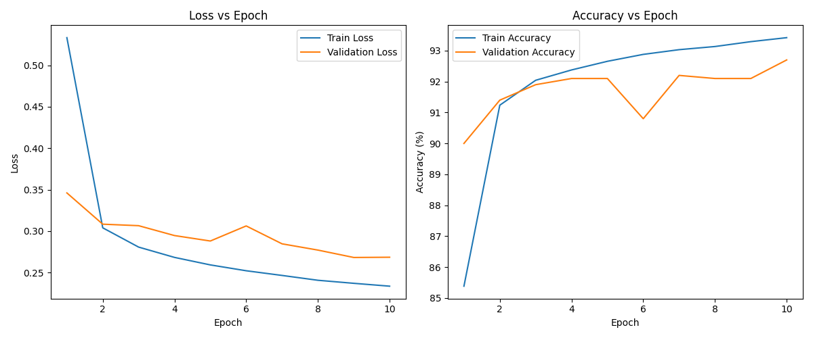

# MNIST NN using PyTorch (CPU)

Created: December 13, 2025 2:48 PM

Daha önce **MNIST** dataseti üzerinde sadece **NumPy** kullanarak bir model eğitmiştik. Orada her şeyi, en küçük türev hesaplamasından parametre güncellemelerine kadar manuel yapıyorduk. Şimdi bu **neural network**'ü **PyTorch** kullanarak çok daha pratik bir şekilde kurguluyoruz.

### PyTorch'a Geçiş: Tensor Dönüşümü

İlk iş olarak NumPy array formatındaki verilerimizi PyTorch’un işleyebileceği **Tensor** formatına çeviriyoruz.

```python
X_val = torch.tensor(X_val, dtype=torch.float32)
```

### Model Tanımlama: nn.Module ile Temiz Mimari

Numpy ile yazdığımız o uzun `init_parameters`, `forward_prop` ve `backward_prop` fonksiyonlarına artık gerek kalmadı. PyTorch’un `nn.Module` yapısı sayesinde modelimizi çok daha temiz bir şekilde tanımlayabiliyoruz:

```
class NeuralNetwork(nn.Module):
    def __init__(self):
        super().__init__()
        self.fc1 = nn.Linear(784, 10)
        self.fc2 = nn.Linear(10, 10)

    def forward(self, x):
        x = torch.relu(self.fc1(x))
        x = self.fc2(x)   # logits
        return x

```

Bu basit gibi görünen ama etkili yapı, iki tam bağlı (fully connected) katmandan oluşuyor. İlk katman 784 boyutlu (28x28 piksel) girdiyi 10 nörona sıkıştırıyor, ikinci katman ise 10 sınıf için logit değerlerini üretiyor.

## Veri Pipeline'ı: Dataset ve DataLoader

PyTorch'ta işleri daha düzenli yönetmek için veri akışını iki aşamalı bir "paketleme" sistemine devrediyoruz:

```python
train_dataset = TensorDataset(X_train, Y_train)
val_dataset = TensorDataset(X_val, Y_val)

train_loader = DataLoader(train_dataset, batch_size=BATCH_SIZE, shuffle=True)
val_loader = DataLoader(val_dataset, batch_size=BATCH_SIZE, shuffle=False)
```

Burada `TensorDataset` dağınık duran tensorleri bir araya getirip, onları tek bir indeks üzerinden (`i. eleman hangisi?`) sorgulanabilir bir **nesneye** dönüştürüyor kısaca.

`DataLoader` ise bu nesne içinden verileri belirlediğin gruplar halinde (batch size) alan, istersen sırasını karıştıran ve eğitim döngüsüne düzenli bir şekilde servis eden **operatör** görevini alıyor**.**

### Eğitim setinde `shuffle=True` kullanarak her epoch'ta farklı bir sırada öğrenmeyi sağlıyoruz. Validation setinde ise `shuffle=False` çünkü orada sadece değerlendirme yapıyoruz.

Device Yönetimi: CPU ve GPU Esnekliği

```python
device = torch.device("cpu") 
# ...model tanımlaması...(model = NeuralNetwork())
model.to(device) 
```

Aslında bu dosyada `device` değişkenini hiç atamasak, `to.(device)` kullanmasak da PyTorch varsayılan olarak CPU kullanıyor. 

Ama bu kodu daha sonra GPU'da çalıştırmak istediğimizde sadece ****`device = torch.device('cuda')` ****satırını değiştirmemiz yeterli olsun diye bu yapıyı kuruyoruz. Böylece kodun geri kalanına hiç dokunmadan, tek bir satırı değiştirerek eğitimi GPU'ya taşıyabiliyoruz. Bu da kodun taşınabilir (portable) ve esnek olmasını sağlıyor.

Loss ve Optimizer Tanımlama

```python
model = NeuralNetwork()
criterion = nn.CrossEntropyLoss()
learning_rate = 1e-3
optimizer = optim.Adam(model.parameters(), lr=learning_rate)
```

NumPy ile yazdığımız neural network'ten farklı olarak burada çok daha gelişmiş bileşenler kullanıyoruz:

1. **Loss fonksiyonu:** Cross Entropy Loss - sınıflandırma problemleri için ideal
2. **Optimizer:** Adam - basit gradient descent'ten çok daha akıllı, momentum ve adaptive learning rate içeren bir optimizasyon algoritması

Bu şekilde modelimizi kurgulamış olduk. Bundan sonraki kod bu modeli eğitiyor ve performansını ölçüyor.

## Training Döngüsü

Modelimizi kurduk, veri pipeline'ımızı hazırladık. Şimdi sıra geldi asıl öğrenme sürecine. Burada yapacağımız şey basitçe: modele verileri göstermek, tahminlerini almak, ne kadar yanıldığını hesaplamak ve parametrelerini buna göre güncellemek. Bu döngüyü 10 epoch (veri setinin baştan sona taranması) boyunca tekrarlayacağız.

### Epoch Döngüsünün Anatomisi

```python
for epoch in range(EPOCHS):
    model.train()
```

Her epoch başında `model.train()` modunu açıyoruz. Bu, PyTorch'a "şu anda eğitim yapıyoruz, dropout gibi katmanlar aktif olsun" diye haber veriyor. Bizim modelimizde dropout yok ama yine de best practice olarak kullanılıyor.

### Batch'ler Üzerinden İlerleme

```python
for batch_idx, (data, target) in enumerate(train_loader):
    data, target = data.to(device), target.to(device)
```

`train_loader` her iterasyonda bize belirlediğimiz *batch size* kadar veri ve etiket çifti veriyor. 

`.to(device)` ile bunları CPU'ya gönderiyoruz .

### Üç Temel Adım: Forward, Loss, Backward

```python
outputs = model(data)              # 1. Forward Pass
loss = criterion(outputs, target)  # 2. Loss Hesaplama

optimizer.zero_grad()              # 3a. Eski gradyanları sıfırla
loss.backward()                    # 3b. Backward Pass (gradyan hesapla)
optimizer.step()                   # 3c. Parametreleri güncelle
```

**1. Forward Pass:** Model girdiyi alıp tahmin üretiyor (logits).

**2. Loss Hesaplama:** Cross Entropy Loss, modelin tahminleriyle gerçek etiketleri (label) karşılaştırıp "ne kadar yanıldın?" sorusuna sayısal bir cevap veriyor. Bu sayı ne kadar düşükse model o kadar iyi tahmin yapıyor demektir.

**3. Backward Pass & Optimization:**

- `optimizer.zero_grad()`: PyTorch gradyanları birikimli tutuyor. Her batch'te sıfırlamazsan önceki batch'lerin gradyanları da hesaba karışıyor ve yanlış güncellemeler yapılıyor.
- `loss.backward()`: Otomatik türev hesaplama (autograd) devreye giriyor. Loss'tan geriye doğru tüm parametrelerin gradyanlarını hesaplıyor. Yalnızca NumPy kullanırken bunu manuel yapmıştık. Şimdi PyTorch bizim için otomatik yapıyor.
- `optimizer.step()`: Adam optimizer bu gradyanları kullanarak parametreleri güncelliyor. Artık basit *gradient descent* değil, momentum ve adaptive learning rate gibi akıllı stratejiler kullanılıyor.

### Metrik Toplama

```python
running_train_loss += loss.item()
pred = outputs.argmax(dim=1)
train_correct += (pred == target).sum().item()
```

Her batch'in loss'unu ve doğru tahmin sayısını topluyoruz.

- **`loss.item()`:** Tensor'dan Python sayısına dönüştürme
- **`argmax(dim=1)`:** Her örnek için en yüksek skorlu sınıfı seçiyor (0-9 arası hangi rakam olduğuna karar veriyor)
- **`(pred == target).sum()`:** Doğru tahmin edilen örneklerin sayısını buluyor

### Validation (Doğrulama) Aşaması

```python
model.eval()
with torch.no_grad():
    for data, target in val_loader:
        outputs = model(data)
        loss = criterion(outputs, target)
```

Epoch bittikten sonra `model.eval()` moduyla modeli "sınav moduna" alıyoruz. Bu mod dropout'u devre dışı bırakır ve batch normalization'ı değerlendirme moduna geçirir.

 `torch.no_grad()` ise PyTorch'a "burada gradyan hesaplama, sadece tahmin yap" diyor. Bu hem hızlandırıyor hem de bellek tasarrufu sağlıyor.

**Validation neden önemli?**

Validation seti eğitim sırasında görülmeyen veriler içeriyor. Buradan aldığımız accuracy, modelin ezberleme yerine gerçekten öğrenip öğrenmediğini gösteriyor. Eğitim accuracy'si %98 ama validation %75 ise model ezberliyor demektir (overfitting). İdeal durumda her iki metrik de birbirine yakın olmalı.

### Loglama ve İzleme

```python
log_file.write(f"[{timestamp}] {epoch+1},{train_accuracy/100:.4f},{val_accuracy/100:.4f},{epoch_time:.4f},{cumulative_time:.4f}\n")
```

Her epoch'un metriklerini hem ekrana yazdırıyoruz hem de bir log dosyasına kaydediyoruz. Böylece:

- Farklı hiperparametreleri karşılaştırabilir
- Hangi noktada overfitting başladığını görebilir
- Eğitim sürecini daha sonra analiz edebiliriz

### Görselleştirme

Son olarak matplotlib ile iki grafik çiziyoruz:

- **Loss grafiği:** Eğitim ve validation loss'larının epoch'lar boyunca nasıl düştüğünü gösteriyor
- **Accuracy grafiği:** Modelin doğruluk oranının nasıl arttığını gösteriyor

İdeal durumda her iki loss da düşmeli, accuracy'ler artmalı ve eğitim/validation arasındaki fark çok büyük olmamalı. 



### Küçük bir not (Özeleştiri)

MNIST veri seti zaten normalize edilmiş ve temiz olduğu için ek bir preprocessing uygulamadım. Ancak **OpenCV** ile data augmentation (veri artırımı) ekleyerek (Örn. rotation, shift vb.)  modelin genelleme gücü bir miktar daha artırılabilirdi.